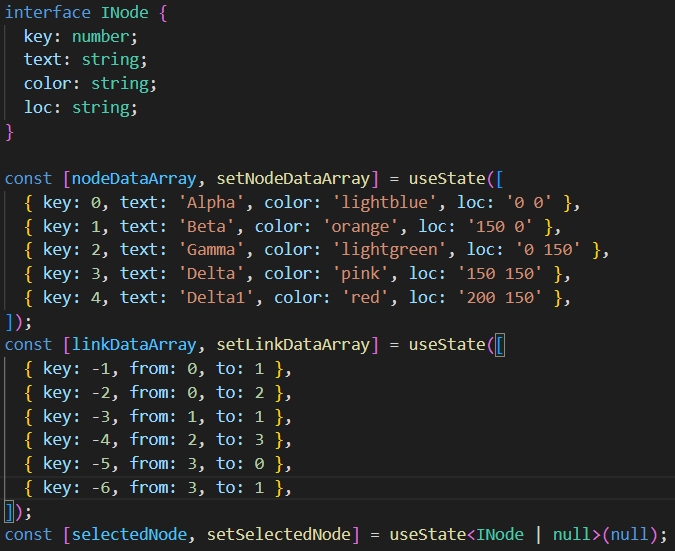
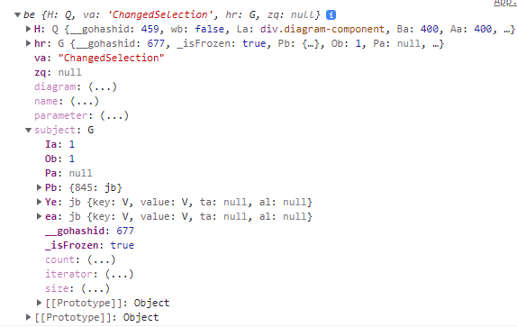
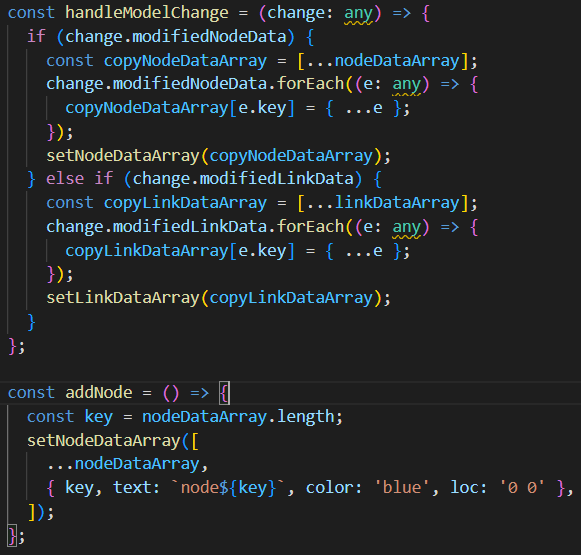

# 1018 TIL

### GoJS 커스텀을 위한 연습
- 샘플코드에서 노드 데이터 배열과 엣지 정보 배열을 state로 관리하도록 수정

- 노드 선택시 전달되는 객체 정보에서 해당 노드의 키 값 도출  

- 새로운 노드 추가시에 발생되는 액션에 따라 동적인 렌더링
    - `nodeDataArray`에 새로운 요소 추가시에 `onModelChange` 라는 이벤트 핸들러 실행
    - `onModelChange`에 할당한 이벤트 핸들러 내에서 추가된 노드의 정보가 파라미터의 `change`에 담기는데, 이를 바탕으로 노드 데이터 배열 갱신
    - 단순히 nodeDataArray에 값을 새로 넣는 것 만으로는 캔버스에 렌더링되지 않고, 꼭 `onModelChange`의 핸들러에 등록해주어야 함

