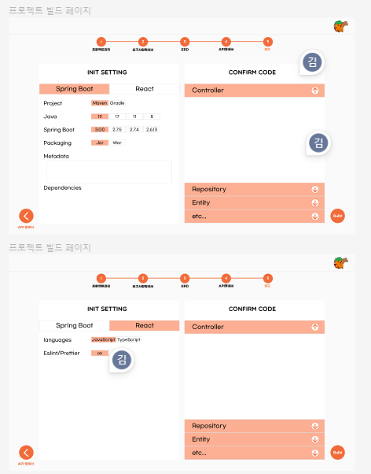
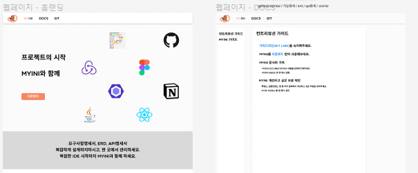

# 1017

* ERD 제작 기능
  * GoJS 이용해서 제작 중
  * 컴포넌트 생성, 관계까지 가능
  * erd에 맞는 컴포넌트 필요 / 관계선 찾아놓음(https://gojs.net/latest/samples/arrowheads.html)

# 1018

* ERD는 제작 해보기로..
* 스켈레톤 와이어프레임 제작 / 수정
  * erd / api / 프로젝트 생성 시 필요한 부분들 조율 필요

# 1019

* 와이어프레임(피그마)
  * 프로젝트빌드
  * 웹페이지(진행중)

