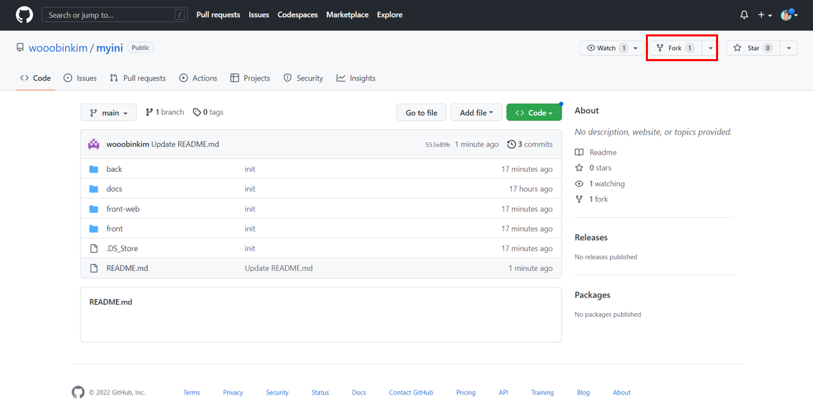
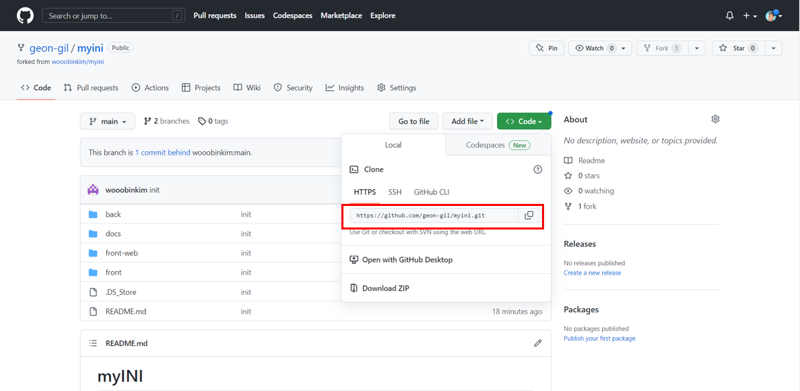
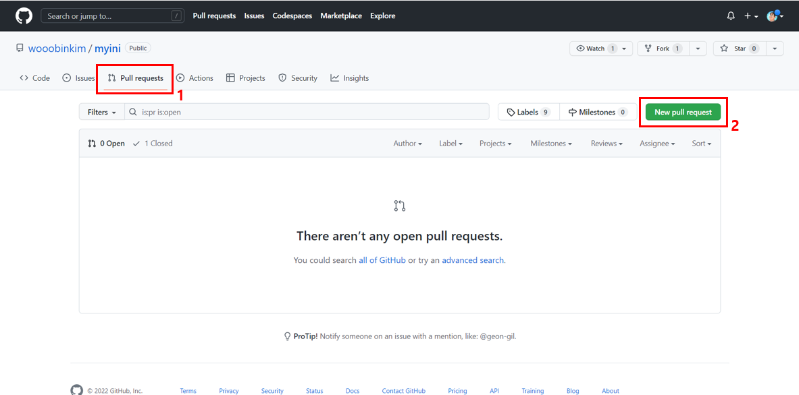

# ContributorGuide

**저희 MYINI는 아래 과정을 통해 컨트리뷰션을 진행하고 있습니다.** 

**코드 수정이 아니더라도 다양한 의견 / 아이디어 등을 통해 MYINI에 기여해주세요.** 

---

### 0. MYINI와 동일하게 개발 버전을 맞춰주세요.

- **BackEnd**
    - **Java** : 11
    - **SpringBoot** : 2.7.5
    - **Gradle** : 7.5.1
- **FrontEnd**
    - 

 

### 1. 우측 상단의 Fork를 눌러 Git Repository를 복제하세요.



### 2. 복제된 Repository에서 Git Clone을 진행하세요.

```bash
git clone "Git Clone URL"
```



### 3. 새로운 브랜치를 생성하여 작업해주세요 브랜치 생성규칙은 [컨트리뷰트 컨벤션](ContributorConvention.md) 을 확인해주세요.

```bash
git branch "새로운 브랜치" "분기시작 브랜치"
```

### 4. [개발컨벤션](CodeConvention.md) 를 토대로 코드를 수정한 후 Fork한 Repository로 Push해주세요. 커밋메세지는 [컨트리뷰트 컨벤션](ContributorConvention.md) 을 확인해주세요.

```bash
# 코드수정 후
git add
git commit
git push
```

### 5. 원본 오픈소스 Repository로 이동하여 Pull Request를 보내주세요. Pull Request 메세지는 [컨트리뷰트 컨벤션](ContributorConvention.md) 을 확인해주세요.




### 6. 개발진이 확인 후 작성하는 Comment를 확인해 주세요. 며칠 시간이 소요될 수 있습니다.


