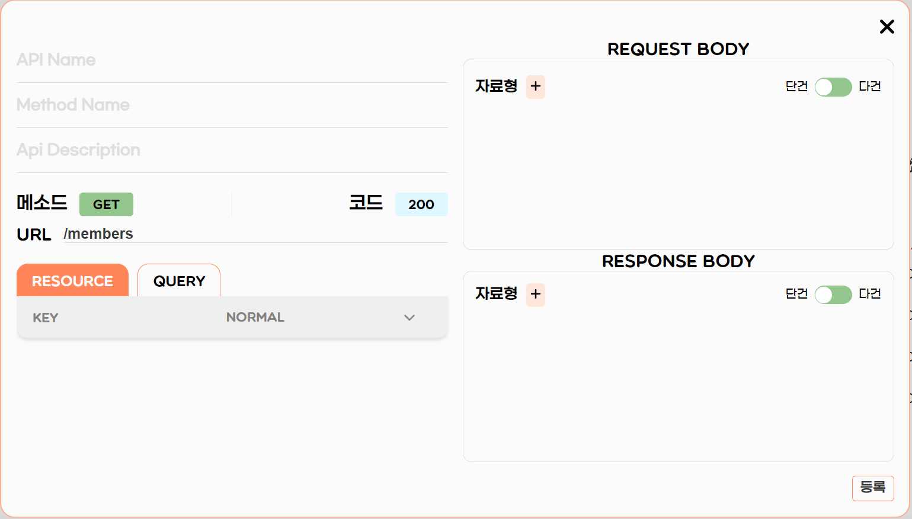

### myINI에는 프로젝트 기획에 필요한 다양한 기능들이 있습니다.
### 동시편집 기능을 제공하여 더 확실한 협업서비스를 제공합니다.
---

## 요구사항 명세서 with JIRA

지라에 이슈를 등록하기 위해서, **myINI 프로젝트와 JIRA 연동이 필요**합니다. 이에 관한 사용 가이드를 참고해주세요.

### 1. 지라이메일 등록

- Jira 계정관리에서 프로필 표시를 **공개**로 설정해주세요.


### 2. 프로젝트의 연동

- Jira 계정관리에서 **JIRA API**키를 발급받고 **JIRA ID**, **JIRA Domain**과 함께 MYINI에 등록해주세요.


### 3. 요구사항 명세서 - 지라 스토리 매핑사항

|**요구사항명세서**|**Jira 스토리**|
|:-----------:|:----------:|
|카테고리|에픽|
|요구사항명|제목|
|요구사항내용|내용|
|구분|제목|
|담당자|보고자 & 책임자|
|중요도|우선순위|
|포인트|스토리포인트|
---

## E-R 다이어그램

서비스 요구사항 기획에 따라 E-R Diagram(개체-관계 다이어그램)을 생성할 수 있습니다.

만들어진 ERD정보를 바탕으로 해당 프로젝트의 Domain(Entity, Repository)이 생성됩니다.

**💡 myINI는 프로젝트를 이니셜라이징 할 때, Database는 MySQL과 JPA를 기준으로 생성됩니다.**


### 1. 테이블

- 우클릭 후 “New Table”을 클릭해 테이블 생성


```bash
💡 테이블명은 Pascal Case로 작성해주세요.
ex) UserInfo
```

### 2. 컬럼

- 더블클릭해 컬럼명 작성


```bash
💡 컬럼명은 Snake Case로 작성해주세요
ex) user_info_id
```

### 3. 제약조건

- Not Null, Unique, Default, Auto Increment 제공
- 우클릭 후 “Primary Key”를 클릭해 PK 지정


### 4. 연관관계

- 우클릭 후 “Relationship”를 클릭해 연관관계 설정
- 연관짓는 테이블과 연관되는 테이블 클릭 후 관계설정


💡 **더 자세한 이용방법은 [vuerd](https://github.com/vuerd/vuerd)에서 찾아보실 수 있습니다. (일부 기능 변형되어 다를 수 있음)**

💡 **ERD tool 출처 : [vuerd](https://github.com/vuerd/vuerd)**

---

## API 명세서

**API 문서에 따라 프로젝트의 기본적인 MVC 패턴 코드를 이니셜라이징 해드립니다.**

### 1. API Controller 생성

각 기능별로 API가 생성될 수 있도록 API Controller를 생성합니다. 이를 토대로 Controller.java가 생성됩니다.


```bash
💡 API Controller는 Pascal Case로 작성해주세요.   
ex) userController.java
```


### 2. API 생성

- 기능에 필요한 API를 생성합니다. API별로 각각의 method가 생성됩니다.



```bash
💡 MethodName은 Camel Case로 작성해주세요.
ex) updateUser
```

### 3. 사용자 정의 클래스 타입이 필요하다면 DTO를 생성할 수 있습니다.

ResponseDTO에서 변수로 쓰일 객체형 DTO는 자료형 관리에서 생성할 수 있습니다.


```bash
💡 DTO 명을 타 DTO와 동일하게 생성하거나, DTO 내부의 변수를 등록하지 않으면 빌드 시 에러가 날 수 있습니다.
```
---

## 빌드
**작성한 문서들을 바탕으로 Spring 초기 프로젝트를 제작해드립니다.**

### 1. 원하는 버전에 맞춰 프로젝트 환경 설정


- **Versions**
  - JVM(***Java Virtual Machine***) 버전
  - Project 언어 명시
  - 패키징 확장자
  - Spring Boot 버전
  - Build 도구
- **Metadata - 프로젝트 상세설명**
  - Group
  - Atifact
  - Name
  - Description
  - Package Name
- **Dependencies - 의존성 추가**

### 2. MVC코드 이니셜라이징


```bash
💡 프로젝트를 다운받은 후 Settings or Preferences에서 **SDK와 자바 버전을 맞춰주세요.**
```
```bash
💡 빌드 후 조치
프로젝트를 실행하기전, MySQL과 연결이 필요합니다. MySQL에서 Database를 생성한 후, 프로젝트 설정파일에서 연결해주세요.
```
